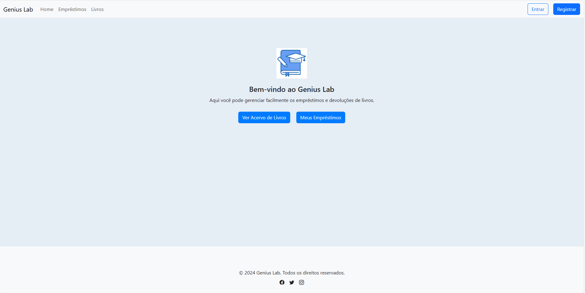

# Genius Lab

Genius Lab é um sistema de gerenciamento de empréstimos de livros, desenvolvido para facilitar o controle e a organização de empréstimos e devoluções. A aplicação possui um painel intuitivo onde os usuários podem navegar facilmente para consultar o acervo e gerenciar seus empréstimos.



## Funcionalidades

- **Registro e Login de Usuários**: Os usuários podem criar uma conta e acessar o sistema para realizar empréstimos.
- **Visualização do Acervo de Livros**: Acesso ao catálogo de livros disponíveis para empréstimo.
- **Gestão de Empréstimos**: Os usuários podem solicitar empréstimos e acompanhar o status de cada um.
- **Interface de Administração**: Um administrador pode aprovar ou recusar os empréstimos solicitados, além de gerenciar o acervo de livros.

## Tecnologias Utilizadas

- **Backend**: Django
- **Frontend**: HTML, CSS, Bootstrap, Jinja
- **Banco de Dados**: PostgreSQL


## Estrutura do Projeto

- **base.html**: Template base para o layout principal do site.
- **Home**: Página inicial com boas-vindas e atalhos para acessar o acervo e os empréstimos.
- **Formulário de Login**: Permite aos usuários autenticados acessar suas informações de empréstimo.
- **Formulário de Registro**: Permite aos novos usuários criarem uma conta.
- **Painel de Administração**: Disponível para administradores, permitindo a gestão de livros e aprovação de empréstimos.

## Configuração e Instalação

1. Clone este repositório:

    ```bash
    git clone https://github.com/Jleandrobr/genius_lab.git
    ```

2. Acesse o diretório do projeto:

    ```bash
    cd genius_lab
    ```

3. Instale as dependências:

    ```bash
    pip install -r requirements.txt
    ```

4. Realize as migrações do banco de dados:

    ```bash
    python manage.py migrate
    ```

5. Crie um superusuário para acesso ao painel de administração:

    ```bash
    python manage.py createsuperuser
    ```

6. Inicie o servidor de desenvolvimento:

    ```bash
    python manage.py runserver
    ```

7. Acesse o projeto em [http://localhost:8000](http://localhost:8000).


## Autor

Desenvolvido por José Leandro Brasileiro.
